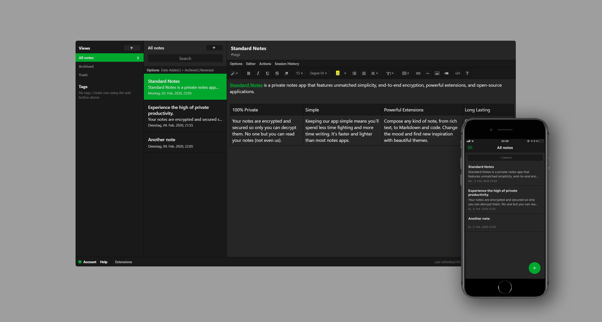

# :elephant: Evernote inspired dark theme for Standard Notes


This theme is inspired by colors from Evernote and heavily based on the [gruvbox theme from Christian Hans](https://github.com/christianhans/sn-gruvbox-dark-theme).<br>
Standard Notes is not related to Evernote.

## How to install

Open "Extensions" in Standard Notes and click "Import Extension". Paste the following URL and press enter:

```
https://danielilin.de/github/sn-theme-evernote-dark/ext.json
```